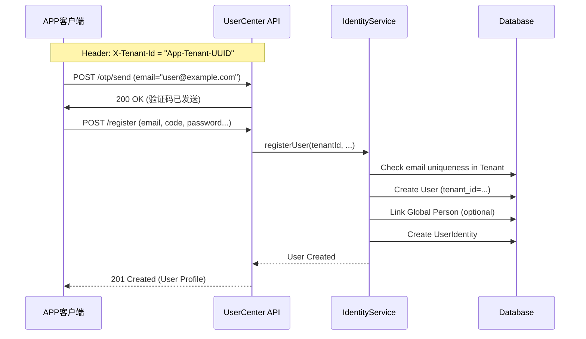
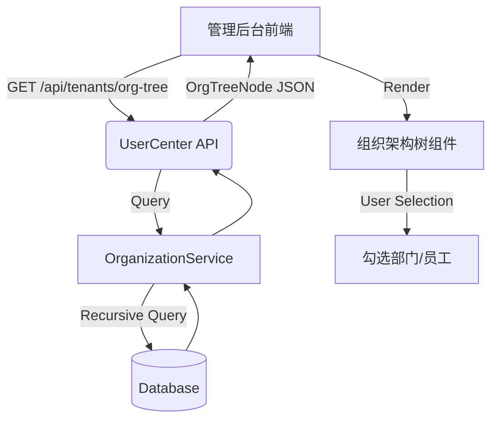
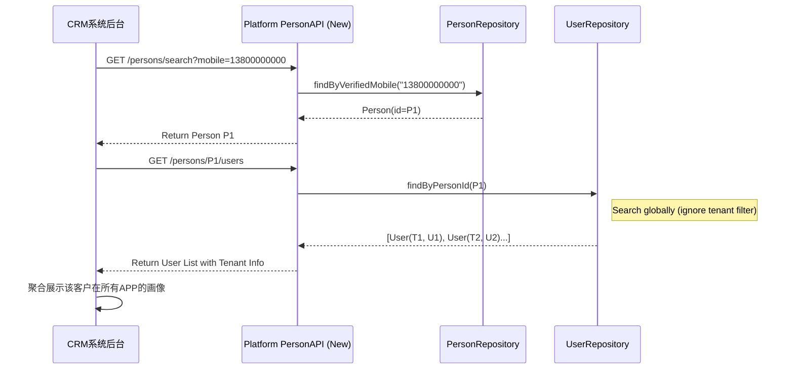

# 场景一：社交 APP（多租户隔离，独立注册）

**场景描述**：
- 公司开发一款社交 APP，服务于多个不同的业务租户（如不同品牌或社区）。
- **C端用户**：客户，在 APP 上注册使用，不感知租户存在。不同 APP 间的用户是完全隔离的。
- **管理端用户**：公司员工，通过组织架构管理 APP 运营，需从组织树勾选。

**支持情况**：✅ **完全支持**

当前系统架构天生支持此场景：
1.  **物理隔离**：`User` 实体强制绑定 `tenant_id`，确保不同 APP（租户）间数据无法互通。
2.  **独立注册**：注册接口要求 `X-Tenant-Id`，即使用户使用相同的手机号/邮箱在不同 APP 注册，也会生成不同的 `User` 记录。
3.  **管理功能**：提供了完整的组织架构管理 API，支持从根节点遍历组织树。

**所需 API 清单**：

| 模块 | API 路径 | 方法 | 用途 |
| :--- | :--- | :--- | :--- |
| **C端用户** | `/api/identities/register` | POST | 用户注册（Header 固定 TenantId） |
| **C端用户** | `/api/identities/otp/send` | POST | 发送验证码 |
| **C端用户** | `/api/identities/otp/verify` | POST | 校验验证码 |
| **C端用户** | `/api/identities/me` | GET | 获取个人资料 |
| **管理端** | `/api/tenants/org-tree` | GET | 获取完整组织树（用于勾选员工） |
| **管理端** | `/api/tenants/org-units` | GET | 查询组织单元列表 |
| **管理端** | `/api/identities` | GET | 根据邮箱查询潜在员工账号 |

**业务流程图 (C端注册)**：



**业务流程图 (管理端选人)**：



---

# 场景二：CRM 系统（跨租户自然人聚合）

**场景描述**：
- 公司开发 CRM 系统，核心资产是“自然人”（Customer Person）。
- **C端业务**：需要识别同一个“自然人”在不同租户（APP）下的所有活动及账号信息。
- **管理端业务**：同样的组织架构选人需求。

**支持情况**：⚠️ **部分支持（需扩展接口）**

- **已支持**：
    - 底层数据模型已包含 `Person` 实体（Global Identity）。
    - `User` 实体已通过 `person_id` 关联到 `Person`，数据基础具备。
    - 管理端的组织树功能（同场景一）已支持。
- **不支持/需补充**：
    - **缺失全局查找 API**：目前无法通过 API 直接查找 `Person` 信息。
    - **缺失反向关联 API**：无法通过 `Person` 查找其关联的所有 `User`（跨租户）。
    - **权限控制**：当前 API 强依赖 Rentant Context，缺乏 Platform 级别的“跨租户上帝视角”权限控制。

**所需 API 清单 (含新增)**：

| 状态 | 模块 | API 路径 | 方法 | 用途 |
| :--- | :--- | :--- | :--- | :--- |
| ✅ | 管理端 | `/api/tenants/org-tree` | GET | 组织选人 |
| 🆕 | **CRM后台** | `/api/platform/persons/search` | GET | 根据手机/身份证查找自然人 |
| 🆕 | **CRM后台** | `/api/platform/persons/{id}/users` | GET | 获取自然人名下所有租户账号 |
| 🆕 | **CRM后台** | `/api/platform/persons/{id}/merge` | POST | 合并两个自然人档案（高级功能） |

**建议补充的接口定义**：

```java
// PlatformPersonController.java (New)
@RestController
@RequestMapping("/api/platform/persons")
public class PlatformPersonController {
    
    // 1. 根据关键信息查找自然人
    @GetMapping("/search")
    public ApiResponse<Person> search(@RequestParam String mobile);

    // 2. 获取自然人关联的所有租户账号
    @GetMapping("/{personId}/users")
    public ApiResponse<List<UserTenantDto>> getLinkedUsers(@PathVariable UUID personId);
}
```

**业务流程图 (CRM 跨租户视图)**：

